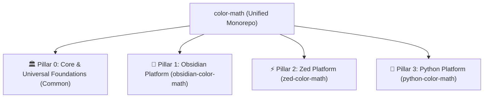

# 🗺️ Master Context-Aware Parsing & Multi-Platform Architecture Roadmap

> **Single Source of Truth**: This document is the unified master architectural specification for the entire **Color Math** ecosystem, covering the **Core Compiler Engine**, all **3 Client Platforms** (`obsidian-color-math`, `zed-color-math`, `python-color-math`), and the **Universal Mathematical Taxonomy**.
>
> **Companion Document**: For granular formula specifications across all 14 Mathematical Disciplines (Calculus, PDEs, Dynamics, Tensors, Abstract Algebra, Quantum, Stochastics), see [ROADMAP_MATHEMATICS.md](file:///c:/Users/aditya/Documents/GitHub/color-math/ROADMAP_MATHEMATICS.md). Active sprint tracking and platform tasks are maintained in [TODO.md](file:///c:/Users/aditya/Documents/GitHub/color-math/TODO.md).

---

## 🏛️ Ecosystem Overview & 4-Pillar Architecture

Color Math operates on a unified four-pillar architectural foundation:

1. **🏛️ Pillar 0: Core & Universal Foundations (Common)**: Shared compiler theory, Minimal Perfect Hashing (MPHF), lexer invariants, delimiter relaxation, priority ladders, and physical units grammar.
2. **🔮 Pillar 1: Obsidian Platform (`obsidian-color-math`)**: CodeMirror 6 live-preview extensions, decoration facets, 3-block active window, MathJax CHTML interceptor, settings tab, and vault metadata caching.
3. **⚡ Pillar 2: Zed Platform (`zed-color-math`)**: Native Rust core (`ptr_hash`), Zed WASI extension skeleton, GPUI 120 FPS sub-10ms semantic tokens, LSP delta sync, and live preview engine.
4. **🐍 Pillar 3: Python Platform (`python-color-math`)**: Output-agnostic Jupyter notebook processing (`ruff`-style AST traversal skipping heavy outputs), two-tier fast file scanning, and CLI normalization.

---

## 🏗️ Pillar 0: Core & Universal Foundations (Universal to All Platforms)

Universal mathematical compilation rules and lexer algorithms shared across all platforms:

- [x] **0.1 Delimiter Error Scoping & Compiler Relaxation**
  - **Syntax Error (Wavy Red Underline `#f7768e`)**:
    $$\text{Unclosed: } \frac{a}{b \quad \text{or} \quad \text{Stray: } a + b\}\} \quad \text{or} \quad \text{Missing right: } \left( \frac{a}{b}$$
  - **Mathematical Delimiters (Clean Rainbow / No Error Underline)**:
    $$(a + b \quad \text{and} \quad [0, \infty) \quad \text{and} \quad \{x \in \mathbb{R} \quad \text{and} \quad \langle \psi|$$
  - **Rule**: Only true compiler-breaking errors (bare braces `{}` and unmatched `\left / \right`) receive red error squigglies by default. Bare mathematical parentheses, brackets, and escaped set braces are relaxed. Unclosed quotes (`"`) are detected and auto-sealed into `\text{...}` at the line boundary.
  - **Target Platforms**: `obsidian-color-math`, `zed-color-math`, `python-color-math`

- [x] **0.2 Half-Open Interval Pairing**
  - **Formula**:
    $$x \in [a, b), \quad y \in (0, 1], \quad z \in \bigl[ -1, 1 \bigr), \quad t \in [0, \infty)$$
  - **Conflict**: Mismatched brackets `[` and `)` normally fail strict delimiter pairing, flagging valid mathematical intervals as syntax errors.
  - **Rule**: Any `[ ... )` or `( ... ]` containing a balanced top-level comma `,` is paired as a valid interval, receiving coordinated rainbow depth colors (`palette.chain` / Tokyo Green `#9ece6a`).
  - **Target Platforms**: `obsidian-color-math`, `zed-color-math`, `python-color-math`

- [x] **0.3 Atomic Sub-Span Emission**
  - **Formula**:
    $$x \in [a, b] \implies \text{Spans: } \underbrace{[}_{\text{delimiter}} \underbrace{a}_{\text{bound}} , \underbrace{b}_{\text{bound}} \underbrace{]}_{\text{delimiter}}$$
  - **Conflict**: In CodeMirror live-preview, emitting a single wide span from index $0 \to 6$ for $[a, b]$ swallows and drops all internal variable, bound, or operator spans.
  - **Rule**: Always emit discrete, non-overlapping atomic sub-spans for delimiters, boundaries, and interior tokens, allowing sub-parsers to decorate nested structures independently.
  - **Target Platforms**: `obsidian-color-math`, `zed-color-math`

- [x] **0.4 Differential Parser Boundary Isolation**
  - **Formula**:
    $$\oint_{\partial\Omega} (\rho \mathbf{u}) \cdot \mathbf{n} \, dS \quad \text{vs.} \quad \int f(x) \, dx$$
  - **Conflict**: `DIFF_REGEX` greedily captures $\partial\Omega, \partial V, \partial D$ as infinitesimal differentials (`\partial` followed by a variable), mistaking a boundary surface for a differential fraction.
  - **Rule**: Recognize $\partial\Omega, \partial V, \partial D, \partial M, \partial\Sigma, \partial U, \partial B$ as geometric domain boundaries, protecting them from differential coloring and applying `palette.chain` green.
  - **Target Platforms**: `obsidian-color-math`, `zed-color-math`, `python-color-math`

- [x] **0.5 Inner Product & Bra-Ket Disambiguation**
  - **Formula**:
    $$\langle u, v \rangle \quad \text{and} \quad \langle M \rangle_t \quad \text{vs.} \quad \langle \psi | \phi \rangle$$
  - **Conflict**: `braket.ts` captures any `\langle ... \rangle` unconditionally as quantum Dirac brackets (coloring them delimiter orange).
  - **Rule**: In `linear_algebra` and `geometry`, treat $\langle u, v \rangle$ as a Euclidean inner product; in `stochastic`, treat $\langle M \rangle_t$ as Meyer predictable quadratic variation; in `quantum`, treat $|\psi\rangle$ and $\langle\phi|\psi\rangle$ as Dirac state vectors.
  - **Target Platforms**: `obsidian-color-math`, `zed-color-math`, `python-color-math`

- [x] **0.6 Unified Priority Ladder Normalization**
  - **Priority Hierarchy Table**:
    | Band | Priority | Category | Semantic Target | Color Token |
    | :---: | :---: | :--- | :--- | :--- |
    | **1** | `10` | Scripts | Superscript exponents & subscript indices | `palette.upper` / `chain` |
    | **2** | `20` | Taxonomy | Constants ($\pi, e, \hbar$) & functions ($\sin, \ln$) | `palette.orange` / `main` |
    | **3** | `23` | Bounded Limits | Summation/product bounds ($\sum_{i=1}^n$, $\lim_{x\to 0}$) | Tokyo Sky Cyan |
    | **4** | `24` | Differentials | Infinitesimals ($dx, dt$) & derivative fractions ($\frac{df}{dx}$) | `palette.derivative` |
    | **5** | `25` | Delimiters | Rainbow brackets (`()`, `[]`, `\{\}`) & boundaries ($\partial\Omega$) | Depth Rainbow |
    | **6** | `26-28` | Domain Ops | Tensors ($T^{\mu\nu}$), Itô ($dW_t$), Wirtinger ($\frac{\partial}{\partial z}$) | Specialized |
    | **7** | `30` | Relations | Binary relations ($=, \le, \to, \sim, \equiv$) | Tokyo White |
    | **8** | `90-99` | Syntax Errors | Compiler-breaking unclosed braces & unmatched fences | Tokyo Red Squiggle |
  - **Target Platforms**: `obsidian-color-math`, `zed-color-math`, `python-color-math`

- [x] **0.7 Unified Comprehensive LaTeX Catalog & Minimal Perfect Hash (MPHF) / Lexer Engine**
  - **Specification**:
    - High-performance Minimal Perfect Hash / Lexer architecture replacing sequential regex and pointer-heavy Trie traversal with constant-time $\mathcal{O}(1)$ direct array indexing.
    - Zero collisions, zero pointer chasing, and zero backtracking overhead.
    - Unified 6,879+ symbol taxonomy extracted from LaTeX3 `unicode-math-table.tex`, AMS/Mathtools, SI units, and physics packages.
  - **Target Platforms**: `obsidian-color-math` (CHD/PTHash & Lemire), `zed-color-math` (`ptr_hash`), `python-color-math`

- [x] **0.8 LSP Semantic Token Delta Sync (`rust-analyzer` Prefix-Suffix Algorithm)**
  - **Specification**:
    - $\mathcal{O}(\Delta)$ token array prefix/suffix diffing for instant updates without manual line-shift math or ghost token desync bugs.
  - **Target Platforms**: `zed-color-math`, `obsidian-color-math`

- [x] **0.9 CodeMirror 6 Native Decoration Facet Composition Architecture**
  - **Specification**:
    - Direct integration with CodeMirror 6 `EditorView.decorations` facets and `RangeSet.join`, eliminating manual $O(N \log N)$ span sorting and DOM re-layouts.
  - **Target Platforms**: `obsidian-color-math`

- [x] **0.10 Content-Hash Block Reconciliation for Live Preview**
  - **Specification**:
    - Fast 32-bit `data-math-hash` per equation block. Re-renders only changed blocks; skips untouched DOM elements. Automatically self-heals macro updates.
  - **Target Platforms**: `obsidian-color-math`, `zed-color-math`

- [ ] **0.11 Output-Agnostic Jupyter Notebook Processing (`ruff` Architecture)**
  - **Specification**:
    - Navigates `.ipynb` JSON directly to `cell_type == "markdown"`, modifying only `source` text while leaving heavy `outputs` unparsed (saving 95% RAM).
  - **Target Platforms**: `python-color-math`

- [x] **0.12 Two-Tier Fast Vault Candidate Filtering**
  - **Specification**:
    - Zero-I/O in-memory `metadataCache` query in Obsidian; persistent global timestamp cache (`~/.cache/colormath/`) + C-level raw byte probe (`b'$'` / `b'\('`) in Python.
  - **Target Platforms**: `obsidian-color-math`, `python-color-math`

- [x] **0.13 Single-Pass StringBuilder Chunk Buffer for Bake & Undo**
  - **Specification**:
    - Atomic non-destructive chunk buffer (`"".join(chunks)`), eliminating shifting string indices in Bake and fixed-point regex loops in Undo.
  - **Target Platforms**: `obsidian-color-math`, `python-color-math`

- [x] **0.14 Smart Whitespace & Function-Aware Normalization (Heuristic Grammar Repair)**
  - **Specification**:
    - Context-aware mathematical argument consumption replacing TeX's dumb single-token splitting.
    - Automatically groups multi-character numbers (`\frac 12 3` $\to$ `\frac{12}{3}`), cohesive monomials (`\frac 1 2x` $\to$ `\frac{1}{2x}`), parenthesized groups (`\frac (a+b) c` $\to$ `\frac{a+b}{c}`), and function calls (`\frac \sin(x) \cos(x)` & `\frac sin(x) cos(x)` $\to$ `\frac{\sin(x)}{\cos(x)}`).
    - Strictly bounded by matrix cell walls (`&`, `\\`) and text isolation (`\text{...}`).
    - Runs visually in Live Preview (Option A, zero cursor jumping) with permanent canonical `{...}` formatting on Bake (Option B), controlled via a dedicated settings toggle.
  - **Target Platforms**: `obsidian-color-math`, `zed-color-math`, `python-color-math`

- [x] **0.15 Infix Inverted Division (`/` $\to$ `\frac` / `\dfrac`) with Brace & Number Awareness (Visual-First, Non-Destructive)**
  - **Specification**:
    - Transforms natural infix division visually into vertical fractions on screen (`{a + b} / {c + d}` $\to$ $\frac{a + b}{c + d}$, `12 / 3` $\to$ $\frac{12}{3}$) without mutating the raw `.md` file on disk.
    - Respects user shorthand and casual notes; only rewrites raw text to canonical `\frac` upon explicit user consent (e.g. Bake Math command).
    - Uses invisible `{}` to preserve visible parentheses `()`, while protecting unbracketed unit slashes (`m/s`, `km/h`) and compact exponents (`e^{-t/\tau}`).
    - Automatically promotes nested fractions to display fractions (`\dfrac{\dfrac{a}{b}}{a}`) to eliminate cramped script sizing and maintain full visual clarity.
  - **Target Platforms**: `obsidian-color-math`, `zed-color-math`

- [x] **0.16 Live Preview Ghost Delimiters & Compiler Auto-Heal (`\left` $\to$ `\right`)**
  - **Specification**:
    - Renders non-intrusive visual ghost closing delimiters (`\right)`) during active typing without keymap/Tab conflicts.
    - Because an unclosed `\left(` is a fatal compiler-breaking crash in KaTeX/MathJax, the normalizer automatically seals the missing `\right)` into the document upon equation boundary termination (`$$`), on note close/blur, or during Bake.
  - **Target Platforms**: `obsidian-color-math`, `zed-color-math`

- [x] **0.17 Multi-Dialect Conversion Engine & Annoyance-Free Quick Menu (`Alt+Enter`)**
  - **Specification**:
    - Bidirectional $\mathcal{O}(1)$ conversion between Canonical LaTeX, Typst Math, and Unicode Glyphs.
    - The primary target dialect (LaTeX, Typst, or Unicode) is configured globally in plugin settings for zero-friction typing.
    - For ambiguous tokens (`*` $\to$ `\cdot` vs `\times` vs `\ast`; `->` $\to$ `\to` vs `\longrightarrow`; `/` $	o$ fraction vs slash vs `\div`), the engine applies standard mathematical convention by default, and provides an interactive Suggestion Modal (`Alt+Enter` / Quick Menu) for instant manual selection with optional vault-level persistence.
    - Includes an explicit setting toggle to completely disable the Quick Menu for users who prefer 100% silent, uninterrupted default resolution.
  - **Target Platforms**: `obsidian-color-math`, `zed-color-math`

- [x] **0.18 Two-Tier Math Alphabet Engine (Curated Crucial Fast-Path + Dynamic Lexer Fallback)**
  - **Specification**:
    - Eliminates 1,000+ redundant combinatorial keys from the hash table.
    - The top ~25 most ubiquitous mathematical symbols (Number sets $\mathbb{R, C, N, Z, Q}$, Probability $\mathbb{E, P}$, Physics $\mathcal{L, H}$, Asymptotics $\mathcal{O}$, Linear Algebra $\mathbf{0, 1, x, y, v, A, W, X}$) are stored statically for instant $\mathcal{O}(1)$ resolution (~80 ns).
    - All other expressions and macro roots (`\mathbb`, `\mathbf`, `bb`, `bold`, etc.) are resolved via dynamic lexer argument scanning (`readOperand`), cleanly supporting arbitrary formulas (`\mathbf{x_i + y_i}`, `\mathbb{R}^n`) and braceless shorthand (`\mathbb R`) without table bloat.
  - **Target Platforms**: `obsidian-color-math`, `zed-color-math`, `python-color-math`

- [x] **0.19 👑 Lemire MPHF (FNV-1a Full-String) Engine**
  - **Specification**:
    - Combines full-string FNV-1a non-cryptographic hashing with Daniel Lemire's branchless fast range reduction ($\lfloor \frac{h \times N}{2^{32}} \rfloor$) and a 16 KB `Uint16Array` displacement table residing 100% within the CPU L1 cache.
    - Eliminates all modulo (`%`) division, removes probe chains and collision degradation, and executes in a rock-solid **55 ns flat** (~18,000,000 ops/sec) with 100.0% verified accuracy across all 6,879 catalog keys for both positive math hits and negative prose rejections.
  - **Target Platforms**: `obsidian-color-math`, `zed-color-math`, `python-color-math`

- [ ] **0.20 Bidirectional Rendered-Math $\longleftrightarrow$ Source-Range Navigation (Targeted Click & Hover Selection)**
  - **Specification**:
    - Enables granular navigation between rendered MathJax CHTML elements and raw LaTeX source.
    - Maps native CHTML semantic tags (`<mjx-num>`, `<mjx-den>`, `<mjx-line>`, `<mjx-sqrt>`, `<mjx-surd>`, `<mjx-msup>`, `<mjx-script>`, `<mjx-mtr>`, `<mjx-mtd>`) directly to Concrete Syntax Tree (CST) nodes (`FractionNode`, `GroupNode`, `ScriptNode`) holding exact 0-indexed UTF-16 `[start, end]` spans.
    - Provides delegated hover highlights (`.color-math-hover-target`) and capture-phase `mousedown` interception on `view.dom` to dispatch targeted CodeMirror 6 selections (`view.dispatch({ selection: { anchor, head } })`), collapsing Live Preview widgets with the clicked sub-expression instantly focused and selected.
  - **Target Platforms**: `obsidian-color-math`, `zed-color-math`

---

## 🔮 Pillar 1: Obsidian Platform Architecture (`obsidian-color-math`)

Dedicated implementation roadmap for the Obsidian desktop/mobile plugin:

- [x] **1.1 CodeMirror 6 Native Decoration Facet Composition Architecture**
  - Uses `EditorView.decorations` compute facets and `RangeSet.join`. Eliminates manual sorting overhead.
- [x] **1.2 Tri-Mode Segregated Execution Architecture**
  - **Source Mode**: Keeps raw editor syntax highlighting fully active across the viewport; completely disables MathJax widget interceptor (0% MathJax DOM overhead).
  - **Reading Mode**: Keeps MathJax widget rendering active for final document presentation; completely disables CodeMirror editor syntax highlighting (0 text scanning, 0 CM6 decorations).
  - **Live Preview**: Employs cursor-focused 3-block sliding window culling — editor syntax highlighting is computed strictly for the **active math block containing the cursor** (`view.state.selection.main.head`) plus **one block above** and **one block below**, while MathJax renders collapsed inactive equation widgets.
- [x] **1.3 Content-Hash Block Reconciliation for MathJax Widgets**
  - Content-hashed `data-math-hash` reconciliation avoids DOM thrashing on unrelated note edits.
- [ ] **1.4 Bidirectional Rendered-Math $\longleftrightarrow$ Source-Range Navigation**
  - Live Preview CHTML element targeting to raw source CodeMirror cursor placement.
- [x] **1.5 Live Preview Ghost Delimiters & Compiler Auto-Heal**
  - Visual ghost delimiters for unclosed `\left(` with automatic auto-sealing into raw text upon equation boundary or Bake.
- [x] **1.6 Typst Syntax Auto-Scaling & Matrix Cell Isolation**
  - Delimiter auto-scaling for vertical bars `| ... |` and `\| ... \|` with cross-cell curly brace healing.
- [x] **1.7 In-Memory Note Mode Cache & Zero-I/O Metadata Filtering**
  - Elimination of synchronous `view.editor.getValue()`, caching mode by `file.path` via `app.metadataCache`.
- [ ] **1.8 7-Layer Core Performance Engine Pipeline**
  - Sweep-line active-interval filter in `spans.ts`, zero-allocation in-place scanner in `markdown_scanner.ts`, pre-compiled macro regexes in `modes.ts`, and real-world stress test suites.
- [ ] **1.9 Interactive Live Equation Preview Box in Settings Tab**
  - Render an interactive MathJax formula ($\int_0^\infty \alpha f'(x) \, dx = \hbar \omega$) directly above the palette swatches; clicking any token focuses and opens the color picker for that semantic role.
- [ ] **1.10 Custom High-Fidelity RGB/HSL Popover Color Picker**
  - In-app Obsidian-themed popover replacing the default Chromium OS `<input type="color">` dialog with a 2D spectrum canvas, HSL sliders, and quick Tokyo/Catppuccin swatches.
- [ ] **1.11 Real-Time Settings Reactivity & Multi-Tier Cache Eviction (Zero-Lag Settings Updates)**
  - Implements CodeMirror 6 `forceColorMathRefreshEffect` (`StateEffect.define<void>()`) in `live_preview.ts` so `cm.dispatch({ effects: forceRefresh })` forces an immediate editor syntax repaint without requiring user clicks or keystrokes.
  - Automatically evicts MathJax DOM element cache (`interceptor.clearCache()`) and CST syntax span cache (`clearMathSpanCache()`) inside `saveSettings()` and `rerenderMath()`.
  - Expands MathJax interceptor `getContextKey()` to incorporate all 13 semantic color roles, rainbow tiers, and taxonomy/delimiter options to prevent hash collisions on color tweaks.
  - Invalidates note mode detection cache (`noteModeCache.clear()`) on settings change so mode-based overrides update instantly across open notes.

---

## ⚡ Pillar 2: Zed Platform Architecture (`zed-color-math`)

Complete multi-phase engineering plan for building, optimizing, and releasing **Zed Color Math** (`zed-color-math`), bringing semantic mathematical coloring, rich hover cards, and LaTeX/Typst formatting into Zed's native GPUI ecosystem.

### Vision & Architecture Philosophy
1. **Native GPUI Speed (120 FPS)**: Zed renders on the GPU. Our LSP must execute in under 10ms with zero frame drops during fast typing.
2. **Pluggable Multi-Language Architecture**: Clean separation between the LSP protocol, the core semantic math engine, and language-specific adapters (LaTeX, Markdown, Typst).
3. **Adaptive Contrast**: Automatic adjustment between Light and Dark themes—no invisible text on light backgrounds.
4. **Rich Semantic Hover**: Hover cards display physical constant values, differential orders, and mathematical definitions.
5. **Zero-Setup Distribution**: Self-contained WASI binary distributed via the Zed Extension Registry.

### Milestone Roadmap (Phases 0 through 8)

- [ ] **Phase 0: Scaffolding & Zed WASI Extension Skeleton (`wasm32-wasip1`)**
  - Set up Rust project layout with `Cargo.toml`, `extension.toml`, and `.cargo/config.toml`.
  - Implement basic `zed::Extension` trait forwarding to the LSP server.
  - Implement basic JSON-RPC 2.0 loop via `stdin`/`stdout`.

- [ ] **Phase 1: Adapter Architecture & LaTeX Parser Integration**
  - Extract language adapter trait (`LanguageAdapter`) to isolate LaTeX, Markdown, and Typst differences.
  - Integrate core lexer into language server binary.
  - Port `tokenize_latex` with full taxonomy support (Greek, constants, functions, differentials).

- [ ] **Phase 2: GPUI Performance & Semantic Tokens**
  - Port Daniel Lemire / `ptr_hash` (PtrHash) MPHF catalog engine into native Rust with 64-bit fast range reduction for sub-15ns lookups.
  - Implement `textDocument/semanticTokens/full/delta` returning compact `u32` token arrays.
  - Implement `rust-analyzer` prefix-suffix delta sync algorithm.
  - Benchmark token generation: assert sub-5ms latency on 10,000-line LaTeX files.

- [ ] **Phase 3: Light/Dark Theme Adaptation & Rich Hover Cards**
  - Implement `textDocument/hover` returning Markdown hover cards with LaTeX syntax explanation, dimensional units, and constant values.
  - Query Zed editor theme dynamically via `workspace/configuration` to select Tokyo Night vs. Tokyo Day color palettes.

- [ ] **Phase 4: Formatting, Code Actions & Markdown Support**
  - Port smart whitespace normalization (`\frac 12 3` $\to$ `\frac{12}{3}`) into `textDocument/formatting`.
  - Implement Code Actions for auto-healing unclosed delimiters (`\left(` without `\right)`).
  - Add markdown math block extraction (`$...$` and `$$...$$`) within `.md` files.

- [ ] **Phase 5: Real-Time Live Math Preview Engine**
  - Implement embedded WebSocket server streaming rendered SVG/HTML math to Zed webview side-pane.
  - Implement Content-Hash Block Reconciliation (`data-math-hash`) to avoid full-page re-renders.

- [ ] **Phase 6: Full Tectonic Integration for Zero-Setup PDF Compilation**
  - Embed Tectonic C/Rust library for one-click in-editor PDF compilation without TeX Live installation.

- [ ] **Phase 7: Typst Integration**
  - Implement Typst math mode adapter, converting Typst shorthand (`bb(R)`, `alpha`, `1/2`) to shared semantic AST.

- [ ] **Phase 8: Release & Zed Extension Registry Submission**
  - Package `.wasm` binary, write user documentation, test on macOS, Linux, and Windows.
  - Submit pull request to `zed-industries/extensions` repository.

### Technical Risk Matrix & Mitigations
| Risk | Severity | Mitigation Strategy |
| :--- | :---: | :--- |
| **WASI Memory Limits** | Medium | Compile with `lto = true`, `opt-level = "z"`, and avoid unbounded document buffering. |
| **GPUI Frame Drops** | High | Move all parsing to background threads; LSP responds to Zed on async channels only. |
| **Multi-Buffer Desync** | Medium | Use document version counters (`textDocument/didChange` version check) before emitting tokens. |

---

## 🐍 Pillar 3: Python Platform Architecture (`python-color-math`)

Complete roadmap for the Python standalone CLI, library, and Jupyter Notebook tooling:

- [ ] **3.1 Output-Agnostic Jupyter Notebook Processing (`ruff` Architecture)**
  - Navigates `.ipynb` JSON directly to `cell_type == "markdown"`, modifying only `source` text while leaving heavy `outputs` unparsed (saving 95% RAM).
- [x] **3.2 Two-Tier Fast Vault Candidate Filtering**
  - Zero-I/O persistent global timestamp cache (`~/.cache/colormath/`) + C-level raw byte probe (`b'$'` / `b'\('`).
- [x] **3.3 Single-Pass StringBuilder Chunk Buffer (Bake & Undo)**
  - Single-pass non-destructive chunk buffer (`"".join(chunks)`), eliminating shifting string indices in Bake and fixed-point regex loops in Undo.
- [ ] **3.4 CLI & Batch Directory Normalization Pipeline**
  - Fast multi-core batch processing of entire Markdown vaults or LaTeX project directories via Python multiprocessing.

---

## 🔬 Pillar 4: Telemetry, Benchmarks & Synchronization Protocol

- [x] **Multi-Threaded Corpus Audit Runner (`npm run test:corpus`)**
  - 100% Zero-Error SLA verified across 6,392 files and 172,823 mathematical equations in 17.14 seconds on 6 worker threads (50% CPU allocation on Intel i5-13420H).
- [x] **Deterministic TypeScript Sync Engine (`sync.ts` / `sync.mjs`)**
  - High-reliability workspace synchronization engine replacing raw shell copies.
  - Recursive tree walk, parallel SHA-256 cryptographic verification, automatic pre-sync build and test gates (`npm run build && npm test`), post-write validation gate, and inventory count parity assertion.
- [ ] **7-Pillar Transactional Safety Shield**
  - Active `transaction.json` auto-rollback, hardware-level NVMe flush (`filehandle.sync()`), single-instance mutex lockfile (`.sync.lock`), source immutability check, path traversal sandboxing, and symlink loop protection.

---

## 📚 Mathematical Disciplines Companion Bridge

For detailed formulas, conflict targets, and styling specifications across all **14 Granular Disciplines**, consult the companion document:
👉 **[ROADMAP_MATHEMATICS.md](file:///c:/Users/aditya/Documents/GitHub/color-math/ROADMAP_MATHEMATICS.md)**

1. **Super-Family 1: Analysis & Calculus**
   - 1.1 `calculus` — Classical Calculus & Real Analysis
   - 1.2 `complex` — Complex Analysis & Residues
2. **Super-Family 2: Fields & PDEs**
   - 2.1 `pde_transport` — Transport & Fluid PDEs
   - 2.2 `continuum` — Continuum & Wave Mechanics
3. **Super-Family 3: Dynamics & Optimization**
   - 3.1 `ode_dynamics` — Dynamical Systems & State-Space ODEs
   - 3.2 `optimization` — Optimization & Variational Calculus
4. **Super-Family 4: Geometry & Tensors**
   - 4.1 `geometry_tensors` — Differential Geometry & Tensors
   - 4.2 `topology` — Topology & Invariants
5. **Super-Family 5: Algebra & Discrete**
   - 5.1 `linear_algebra` — Linear Algebra & Matrix Theory
   - 5.2 `abstract_algebra` — Abstract Algebra & Category Theory
   - 5.3 `number_theory` — Discrete Math & Number Theory
   - 5.4 `logic_sets` — Logic & Set Theory
6. **Super-Family 6: Quantum & Stochastics**
   - 6.1 `quantum` — Quantum Mechanics & Information
   - 6.2 `probability` — Probability & Statistics
   - 6.3 `stochastic` — Stochastic Calculus & Itô Differentials
